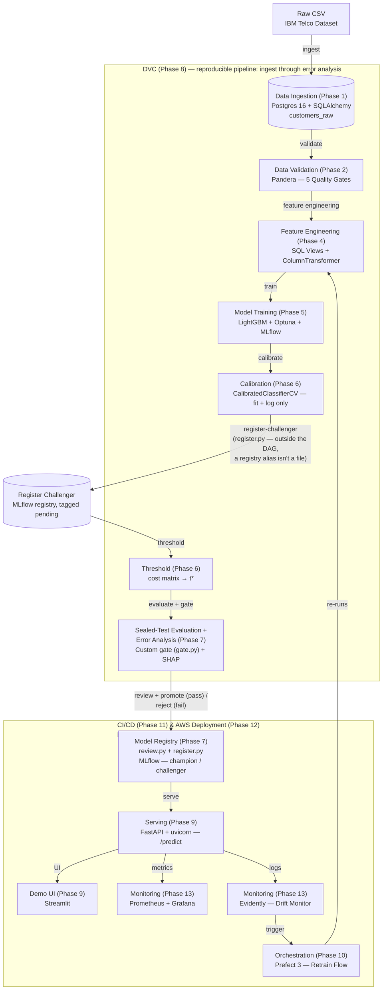
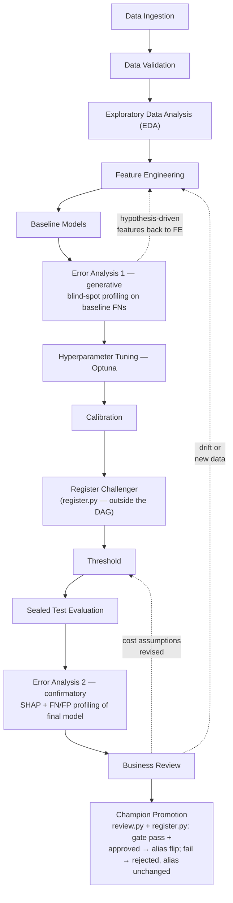
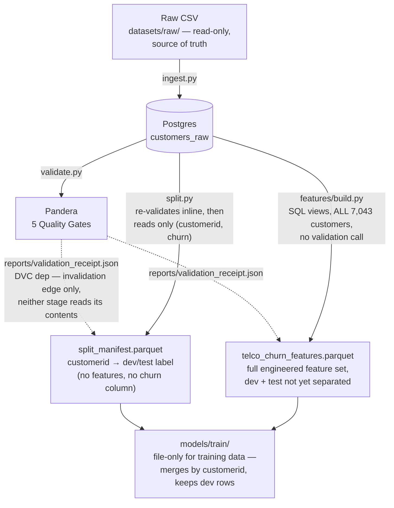
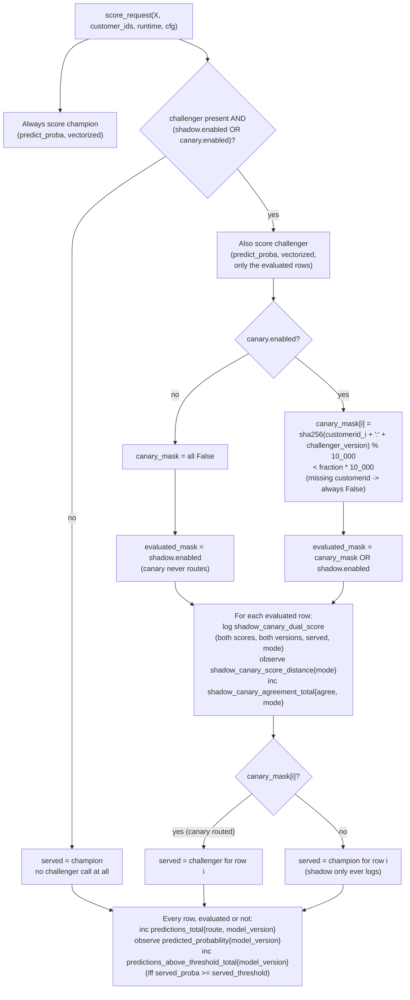
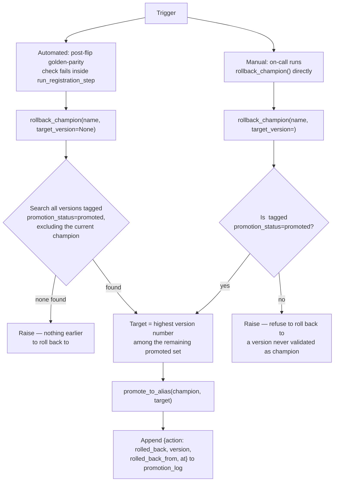

# Telco Churn — Architecture

> **What each view is for:** System Architecture is the tool-level infrastructure flow, ingest to monitoring; ML Workflow is the modelling lifecycle and its feedback loops; Data Flow is the artifacts moving through ingestion into training; MLflow Layout is the run/registry structure one training cycle builds up inside MLflow.
>
> Ingestion through the DVC pipeline wrap (Phases 1–8) is implemented, verified against the code that produces it; everything past that (Phases 9–14) is target only. The System Architecture diagram below is the one view spanning both ranges — everything through Model Registry is built, Serving onward is not. The ML Workflow diagram stays entirely within the built range: its first feedback loop (Error Analysis 1 → Feature Engineering) is an iteration within a single training cycle, not an Orchestration concern; its other two (Business Review → Calibration/Threshold or Feature Engineering) are the triggers Orchestration (Phase 10) will eventually automate — for now they're manual. The Data Flow and MLflow Layout diagrams also stay entirely within the built range — keep them in sync whenever the underlying modules change shape.

## System Architecture

The tool-level view: what infrastructure or library sits at each step, from raw CSV to monitored production traffic.



DVC's real boundary spans the whole pipeline drawn inside the subgraph above, **including Calibration (F1) and Threshold (F2)** — both are deterministic, DVC-tracked stages (`dvc.yaml`'s `calibrate`/`threshold`), not decision steps DVC opts out of. What DVC genuinely cannot express is the registry mutation itself: minting the challenger version (`Register Challenger`) and the final promote/reject (`Model Registry`) are both registry writes, and a registry alias is not a file DVC's dependency graph can hash — that is the actual boundary. It is also why `dvc repro` runs in two calls per cycle, not one: `dvc repro calibrate` reproduces everything up to and including Calibration, then `register-challenger` mints a version, then `dvc repro error_analysis` carries Threshold through Error Analysis — Threshold structurally cannot run before a version exists for it to resolve.

## ML Workflow — a loop, not a straight line

The diagram below shows the **modelling lifecycle** the system runs on top of, including the two feedback loops that a linear summary hides.



**Solid arrows** — main linear flow. **Dashed arrows** — feedback loops. Full rationale: the Error Analysis 1 loop in `ANALYSIS.md` §4a's "Generative diagnostic loop" subsection; the Business Review loops in §6 (cost-assumption uncertainty) and §8–§10 (drift-monitoring baseline, periodic recalibration).

## Data Flow — Ingestion to Training

This shows *artifacts* — what each stage actually reads and writes, and which stages touch the database at all.



`V` is no longer a dead end as of Phase 8: `split.py` and `features/build.py` both still read their actual data straight from `customers_raw` (`validate.py`'s job is quality gating, not producing a queryable artifact), but `dvc.yaml`'s DAG now makes both stages `dep` on `reports/validation_receipt.json` as an invalidation edge — a failing gate exits 1 before either stage runs, and DVC will not consider `split`/`features` up to date without a passing validation behind them. This is DVC-enforced, not just documented intent. `models/train/` isn't fully DB-free either — `tuning.py` opens its own Postgres connection for Optuna's crash-resilient trial storage (a separate schema, same server as MLflow's backend); only the *training data* (features + split labels) is file-only.

## MLflow Layout — Training Through Promotion (Phases 5–7)

This zooms into what `models/train/` writes to MLflow as it runs — one training cycle, not one MLflow run. It actually produces eight top-level runs (three single-candidate fits, a comparison run, a selection run, one run that keeps growing through tuning/calibration/threshold/registration, and two sealed-test siblings), plus up to fifty more nested inside that growing run, one per Optuna trial. The underlying rule: where something is logged is decided by who needs to find it again later, not by which phase produced it.

```mermaid
flowchart TD
    A["models/train/candidates.py\ndummy_prior, logreg_cv, lgbm_default\n(one run per candidate, CV on telco_churn_dev)"] -->|"comparison.py"| B["model_comparison run (sibling)\ncomparison/: comparison_table.csv,\nbootstrap_delta_dist.png, pr_curves.png\ndiagnostics/: segment_fairness(_delta).csv,\nsegment_robustness(_delta).csv, fixed_recall_profile.csv"]
    B -->|"feature_audit.py"| C["feature_audit run (sibling)\nselection/: committed_features.txt, high_shap_dropouts.txt,\nshap_importance_audit.csv, permutation_importance_table.csv,\nper_fold_stability.csv, bootstrap_delta_dist.png, pr_curves.png"]
    C -->|"log_model.py\nOptuna-tuned LightGBM (tuning.py logs\nnested trial_NNN runs, up to 50)"| D["tuning_study run (root)\nfeature_space.txt, feature_columns.txt,\npreprocessing.pkl, training_manifest.json, tuning/\nmodel (LoggedModel — unregistered)"]
    D -->|"calibrate.py fits + logs;\nregister.register_challenger mints"| E["tuning_study/calibration/\ncalibration_summary.json, golden_predictions.json,\ndev_oof_predictions.parquet, figures/\ncalibrated_model (LoggedModel) registered as\ntelco-churn-pipeline — tags: training_data_scope=dev,\nlogged_model_id, promotion_status=pending\nalias: challenger"]
    E -->|"threshold.py\n(+ folded-in dev-OOF screen)"| F["tuning_study/threshold/\nthreshold.json, threshold_validation.json,\nev_curve.parquet, dev_oof_diagnostics.json, figures/"]
    F -->|"evaluate.py"| G["evaluation run (sibling)\nmetrics.json, economics.json,\npromotion_decision.json (gate.py decide_promotion),\ntest_predictions.parquet, figures/\nreports/eval_receipt.json (register.py's\nfirst-pass bootstrap pointer)"]
    G -->|"error_analysis.py"| H["error_analysis run (sibling)\nerror_analysis.json, shap_values.parquet, figures/\nslices/: error_concentration.json\nreports/error_analysis_receipt.json"]
    H -->|"models/review.py\n(gate.record_review)"| RV["promotion_review.json on the eval run\nappend-only entries: verdict, notes,\napprover, reviewed_at"]
    RV -->|"register.py\nMlflowClient only — opens no run,\ncomputes no metrics"| I{"reads promotion_decision.json +\npromotion_review.json + error_analysis.json;\ntags version: eval_run_id, test_pr_auc, test_recall,\ntest_brier, test_calibration_slope, error_analysis_run_id\n(from tag, else the two receipts above, on this\nversion's first pass); re-checks gate + review +\nsmoke check + golden parity"}
    I -->|"pass"| J["tuning_study/registration/\ndrift_reference.json, model_card.json\nversion: promotion_status → promoted,\npromotion_log entry appended\nalias champion → this version"]
    I -->|"fail (human reject / gate /\nsmoke-check / post-flip parity)"| K["version: promotion_status → rejected\n(reason recorded in version description)\nchampion alias untouched, or rolled back"]
```



**The registry version's state travels through tags, not just an alias.** Each version starts `promotion_status: pending` — the safe default, since a crash mid-cycle should never look like a pass or a legitimate rollback target. `register.py` is the only step that writes a model-version tag: it resolves the evaluation/error-analysis identity from the tag if a prior pass already wrote it, else from `evaluate.py`'s/`error_analysis.py`'s receipts, tags it, re-verifies the gate and the human review verdict, and flips the status to `promoted` or `rejected` — which is why a rollback should always target the highest version tagged `promoted`, never "the previous version number": a rejected or crashed cycle leaves behind a version that otherwise looks the same.

## Shadow/Canary Serving — `serving/predict.py` (Phase 9)

`register.py`'s mint-to-flip gap (`register_challenger` mints `challenger`; a
separate, later call flips `champion` on a pass) leaves both aliases
simultaneously resolvable for as long as evaluation and review take. That gap
is the precondition shadow/canary needs, and `serving/predict.py` is where
the mechanism actually lives — continuously available to any traffic that
hits scoring whenever a `challenger` exists, independent of whether a retrain
cycle is in progress.



**Five Prometheus metrics come out of this one function, not two.** The
`route` label on the three general-purpose counters/histograms
(`predictions_total`, `predicted_probability`,
`predictions_above_threshold_total`) is `"champion"` for a row that was
never evaluated against the challenger at all, or the dual-score entry's own
`mode` (`"shadow"`/`"canary"`) for a row that was — so a canary configured
at `fraction=0.1` can be confirmed as actually landing near 10 % of traffic
by reading `predictions_total{route="canary"}` against the total, rather
than just trusting the config. The other two
(`shadow_canary_score_distance`, a histogram of
`abs(challenger_score - champion_score)`, and
`shadow_canary_agreement_total`, a counter of whether champion and
challenger landed on the same side of their own respective thresholds) are
observed only for evaluated rows, labelled `mode` and (for agreement)
`agree`. None of the five carry a `model_version` label on the
shadow/canary-specific pair — the champion/challenger comparison already
spans exactly two versions, one per side. `serving/app.py`'s `GET /metrics`
exposes all five with no extra wiring: `prometheus_fastapi_instrumentator`
exposes the whole default registry `prometheus_client` registered these
five onto at import time, not just the metrics it instrumented itself.

**Two independent, config-gated toggles (`configs/serving/api.yaml`:
`shadow.enabled`, `canary.enabled` + `canary.fraction`), both off by
default.** Shadow scores every request against the challenger for
comparison but never serves its opinion — zero routing risk, pure
observability. Canary actually routes a consistent-hash slice of traffic to
the challenger — bounded routing risk, needed because some failure modes
only surface once a model's output has real consequences. They solve
different problems and are built as separate mechanisms, not one flag with
two readings; both can be on at once, in which case a row outside the canary
bucket is still dual-scored (because shadow says so) but served by champion.

**Canary bucketing is consistent hashing on `customerid`, salted with the
challenger's own `model_version`
(`sha256(f"{customerid}:{challenger_version}") % 10_000 < fraction *
10_000`), never per-request randomness** — the same customer lands in the
same bucket for the life of one challenger's canary window instead of
flapping between models call to call. The salt is what makes that window
one *fresh, independent* customer slice rather than the identical subset on
every canary this project ever runs: since the challenger's version is part
of the hash key, a customer's bucket assignment reshuffles the next time
`challenger` moves to a different version, even though it stays fixed for
as long as the current version is under test. A request with no
`customerid` (a prospect scored in manual/what-if mode) is never
canary-routed: no targeting key means the default variant (champion), the
same rule feature-flag platforms (LaunchDarkly, OpenFeature) use.

**`resolve_champion_model`/`resolve_challenger_model` are the single
indirection point** — no call site anywhere resolves `models:/…@champion` or
`@challenger` directly. Both poll on a TTL, diff the target version's
MLflow-logged dependencies against what's installed
(`environment_parity.py::diff_environment`) before hot-reloading, and — for
the champion — fail-open on a refresh problem (keep serving the last-known-
good bundle, log a warning) but fail-closed on the very first load (no
champion in memory yet, nothing safe to fall back to). A challenger problem
is never a reason to disrupt champion traffic either way. The SHAP explainer
and the threshold policy travel inside the same `ModelBundle` a reload swaps
in one piece, so neither can end up paired with a different model version's
score.

**Evidence below is *not* from `tests/unit/test_predict.py` itself — that
suite deliberately fits its champion/challenger pair on synthetic data for
speed and determinism (see its module docstring). Regenerating this
snippet's realism requires the thing the unit tests are built to avoid:
real customers.** So it is produced by a small one-off script, run the same
way the mechanism test is structured (two real
`CalibratedClassifierCV(LGBMClassifier)` pipelines registered as
`champion`/`challenger` against a tmp-scoped MLflow store) but fit on real
`tenure`/`monthlycharges` values and real churn labels from
`data.split.partition`'s **dev** side only, loaded straight from
`datasets/processed/split_manifest.parquet` — never the sealed test side.
Six dev-partition customers, one per tenure sextile, were then scored
through the real `score_request` with `shadow.enabled=true` (champion `t*
= 0.4`, challenger `t* = 0.6`, versions 1/2):

```json
{"customerid": "1087-GRUYI", "champion_version": "1", "champion_score": 0.052926906761486600, "challenger_version": "2", "challenger_score": 0.052268186900639425, "served": "champion", "mode": "shadow", "event": "shadow_canary_dual_score"}
{"customerid": "4189-NAKJS", "champion_version": "1", "champion_score": 0.085580031785222140, "challenger_version": "2", "challenger_score": 0.084804168943478090, "served": "champion", "mode": "shadow", "event": "shadow_canary_dual_score"}
{"customerid": "7321-ZNSLA", "champion_version": "1", "champion_score": 0.381320170055880400, "challenger_version": "2", "challenger_score": 0.381786367680829000, "served": "champion", "mode": "shadow", "event": "shadow_canary_dual_score"}
{"customerid": "6968-GMKPR", "champion_version": "1", "champion_score": 0.131177544000207730, "challenger_version": "2", "challenger_score": 0.130389959439198650, "served": "champion", "mode": "shadow", "event": "shadow_canary_dual_score"}
{"customerid": "0971-QIFJK", "champion_version": "1", "champion_score": 0.044880156423729396, "challenger_version": "2", "challenger_score": 0.044270441986991246, "served": "champion", "mode": "shadow", "event": "shadow_canary_dual_score"}
{"customerid": "8909-BOLNL", "champion_version": "1", "champion_score": 0.382721088645554760, "challenger_version": "2", "challenger_score": 0.383196816141353000, "served": "champion", "mode": "shadow", "event": "shadow_canary_dual_score"}
```

Every row carries `served: "champion"` (shadow never routes) and both
model versions/scores side by side — exactly what an offline job needs to
later compute agreement rate and score-distance between champion and
challenger. This particular batch happens to land all six on the same side
of both thresholds, which is exactly what the Prometheus counters below
confirm rather than assert on faith:

```text
shadow_canary_score_distance_count{mode="shadow"}          6
shadow_canary_score_distance_sum{mode="shadow"}             0.003773806821085267
shadow_canary_agreement_total{agree="true", mode="shadow"}  6
predictions_total{route="shadow", model_version="1"}        6
predicted_probability_count{model_version="1"}              6
predicted_probability_sum{model_version="1"}                1.0786058976720811
```

Switching to `canary.enabled=true, fraction=1.0` against the same runtime
routes every row to the challenger instead (`served: "challenger"`,
`mode: "canary"`); `fraction=0.0` routes none — both re-verified directly
against `tests/unit/test_predict.py::test_score_request_canary_fraction_one_routes_everyone_to_challenger`
and `::test_score_request_canary_fraction_zero_routes_everyone_to_champion`,
which pin this behavior on their own synthetic fixture (23/23 tests in that
file pass on the current code). Phase 10's `require_traffic_validation`
seam is where a real canary observation window's *result* would eventually
gate a promotion — this project's static dataset has no live traffic for
that window to observe, so that decision layer is honestly stubbed to
no-op rather than faked with replayed rows standing in for a real verdict.
The routing/logging/metrics *mechanism* documented here is real and tested;
a live production shadow/canary result is not, and must never be implied
as one.

## Emergency Rollback — `register.py::rollback_champion`

Two independent triggers write to the same append-only `promotion_log` tag on the registered model, so "what was champion before this one" is always a direct index into one history, never a tag-scan-and-`max()` reconstruction.



**Never version arithmetic (`N-1`).** A rejected or crashed evaluation cycle can leave a higher-numbered version in the registry with no `champion` alias and no `promoted` tag — indistinguishable from a legitimate former champion by version number alone. Selecting on the `promotion_status` tag is the one query that can't land on that version by accident. `champion_history()` reads the same `promotion_log` tag back as an ordered list, so "what was champion two promotions ago" is `history[-3]`, not a re-derivation.
