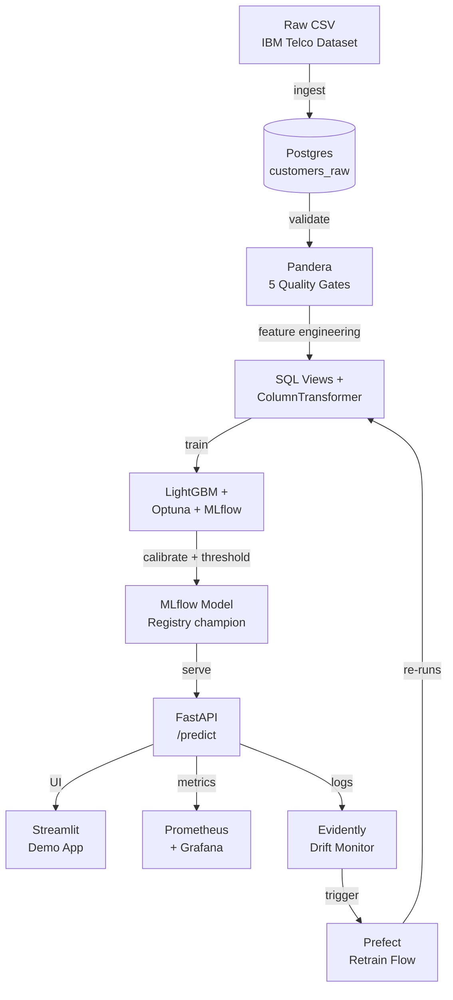
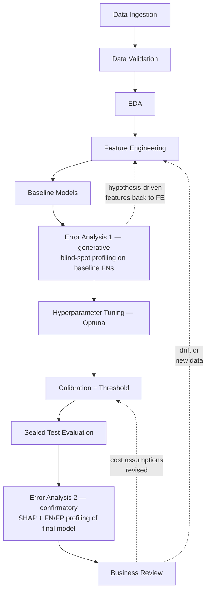

# Architecture

> This diagram reflects the target architecture. It will be updated as each phase is completed.

## ML Workflow — a loop, not a straight line

The system diagram above shows the infrastructure flow. The diagram below shows the **modelling lifecycle**, including the two feedback loops that a linear summary hides.

**Solid arrows** — main linear flow. **Dashed arrows** — feedback loops. Full rationale for both loops is in `ANALYSIS.md` §0.

---

## Components

| Component | Tool | Phase |
|---|---|---|
| Data ingestion | Postgres 16 + SQLAlchemy | 1 |
| Data validation | Pandera | 2 |
| Feature engineering | SQL views + sklearn ColumnTransformer | 4 |
| Model training | LightGBM + Optuna + MLflow | 5 |
| Calibration + threshold | CalibratedClassifierCV + cost matrix | 6 |
| Model registry | MLflow (champion / challenger) | 7 |
| Pipeline reproducibility | DVC | 8 |
| Serving | FastAPI + uvicorn | 9 |
| Demo UI | Streamlit | 9 |
| Orchestration | Prefect 3 | 10 |
| CI/CD | GitHub Actions + AWS ECR + App Runner | 11–12 |
| Monitoring | Prometheus + Grafana + Evidently | 13 |
