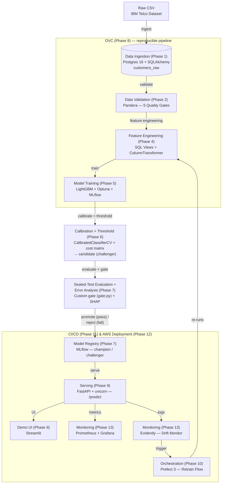
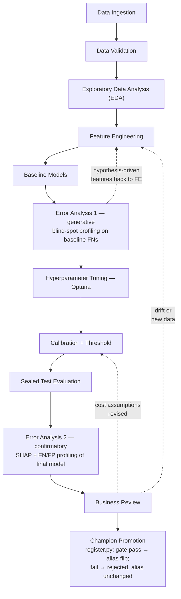
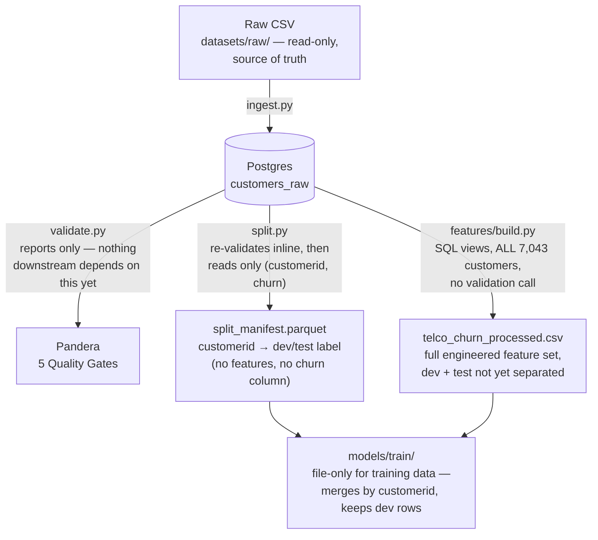
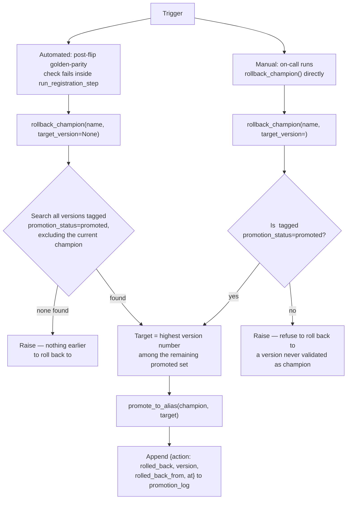

# Telco Churn — Architecture

> **What each view is for:** System Architecture is the tool-level infrastructure flow, ingest to monitoring; ML Workflow is the modelling lifecycle and its feedback loops; Data Flow is the artifacts moving through ingestion into training; MLflow Layout is the run/registry structure one training cycle builds up inside MLflow.
>
> Ingestion through champion promotion (Phases 1–7) is implemented, verified against the code that produces it; everything past that (Phases 8–14) is target only. The System Architecture diagram below is the one view spanning both ranges — everything through Model Registry is built, Serving onward is not. The ML Workflow diagram stays entirely within the built range: its first feedback loop (Error Analysis 1 → Feature Engineering) is an iteration within a single training cycle, not an Orchestration concern; its other two (Business Review → Calibration/Threshold or Feature Engineering) are the triggers Orchestration (Phase 10) will eventually automate — for now they're manual. The Data Flow and MLflow Layout diagrams also stay entirely within the built range — keep them in sync whenever the underlying modules change shape.

## System Architecture

The tool-level view: what infrastructure or library sits at each step, from raw CSV to monitored production traffic.

DVC's real boundary is tighter than the box above implies: it also covers Sealed-Test Evaluation (G) — `train → evaluate` is fully DVC-tracked — but deliberately excludes Calibration + Threshold (F) and Model Registry promotion (H). Both are decision steps on mutable state (a held-out calibration fold; the live `champion` alias) rather than deterministic data transforms, so keeping them out of `dvc repro` is by design, not oversight — folding them in would make reruns non-deterministic.

## ML Workflow — a loop, not a straight line

The diagram below shows the **modelling lifecycle** the system runs on top of, including the two feedback loops that a linear summary hides.

**Solid arrows** — main linear flow. **Dashed arrows** — feedback loops. Full rationale: the Error Analysis 1 loop in `ANALYSIS.md` §4a's "Generative diagnostic loop" subsection; the Business Review loops in §6 (cost-assumption uncertainty) and §8–§10 (drift-monitoring baseline, periodic recalibration).

## Data Flow — Ingestion to Training

This shows *artifacts* — what each stage actually reads and writes, and which stages touch the database at all.

`V` is a dead end by design, for now: `split.py` and `features/build.py` both read straight from `customers_raw`, independent of whether `validate.py` ran — there's no DVC DAG (Phase 8) yet enforcing "validate must pass first," just documented intent. `models/train/` isn't fully DB-free either — `tuning.py` opens its own Postgres connection for Optuna's crash-resilient trial storage (a separate schema, same server as MLflow's backend); only the *training data* (features + split labels) is file-only.

## MLflow Layout — Training Through Promotion (Phases 5–7)

This zooms into what `models/train/` writes to MLflow as it runs — one training cycle, not one MLflow run. It actually produces eight top-level runs (three single-candidate fits, a comparison run, a selection run, one run that keeps growing through tuning/calibration/threshold/registration, and two sealed-test siblings), plus up to fifty more nested inside that growing run, one per Optuna trial. The underlying rule: where something is logged is decided by who needs to find it again later, not by which phase produced it.

```mermaid
flowchart TD
    A["models/train/candidates.py\ndummy_prior, logreg_cv, lgbm_default\n(one run per candidate, CV on telco_churn_dev)"] -->|"comparison.py"| B["model_comparison run (sibling)\ncomparison/: comparison_table.csv,\nbootstrap_delta_dist.png, pr_curves.png\ndiagnostics/: segment_fairness(_delta).csv,\nsegment_robustness(_delta).csv, fixed_recall_profile.csv"]
    B -->|"feature_audit.py"| C["feature_audit run (sibling)\nselection/: committed_features.txt, high_shap_dropouts.txt,\nshap_importance_audit.csv, permutation_importance_table.csv,\nper_fold_stability.csv, bootstrap_delta_dist.png, pr_curves.png"]
    C -->|"log_model.py\nOptuna-tuned LightGBM (tuning.py logs\nnested trial_NNN runs, up to 50)"| D["tuning_study run (root)\nfeature_space.txt, feature_columns.txt,\npreprocessing.pkl, training_manifest.json, tuning/\nmodel (LoggedModel — unregistered)"]
    D -->|"calibrate.py fits + logs;\nregister.register_challenger mints"| E["tuning_study/calibration/\ncalibration_summary.json, golden_predictions.json,\ndev_oof_predictions.parquet, figures/\ncalibrated_model (LoggedModel) registered as\ntelco-churn-pipeline — tags: training_data_scope=dev,\nlogged_model_id, promotion_status=pending\nalias: challenger"]
    E -->|"threshold.py\n(+ folded-in dev-OOF screen)"| F["tuning_study/threshold/\nthreshold.json, threshold_validation.json,\nev_curve.parquet, dev_oof_diagnostics.json, figures/"]
    F -->|"evaluate.py"| G["evaluation run (sibling)\nmetrics.json, economics.json,\npromotion_decision.json (gate.py decide_promotion),\ntest_predictions.parquet, figures/\nreports/eval_receipt.json (register.py's\nfirst-pass bootstrap pointer)"]
    G -->|"error_analysis.py"| H["error_analysis run (sibling)\nerror_analysis.json, shap_values.parquet, figures/\nslices/: error_concentration.json\nreports/error_analysis_receipt.json"]
    H -->|"models/review.py\n(gate.record_review)"| RV["promotion_review.json on the eval run\nappend-only entries: verdict, notes,\napprover, reviewed_at"]
    RV -->|"register.py\nMlflowClient only — opens no run,\ncomputes no metrics"| I{"reads promotion_decision.json +\npromotion_review.json + error_analysis.json;\ntags version: eval_run_id, test_pr_auc, test_recall,\ntest_brier, test_calibration_slope, error_analysis_run_id\n(from tag, else the two receipts above, on this\nversion's first pass); re-checks gate + review +\nsmoke check + golden parity"}
    I -->|"pass"| J["tuning_study/registration/\ndrift_reference.json, model_card.json\nversion: promotion_status → promoted,\npromotion_log entry appended\nalias champion → this version"]
    I -->|"fail (human reject / gate /\nsmoke-check / post-flip parity)"| K["version: promotion_status → rejected\n(reason recorded in version description)\nchampion alias untouched, or rolled back"]
```

**The registry version's state travels through tags, not just an alias.** Each version starts `promotion_status: pending` — the safe default, since a crash mid-cycle should never look like a pass or a legitimate rollback target. `register.py` is the only step that writes a model-version tag: it resolves the evaluation/error-analysis identity from the tag if a prior pass already wrote it, else from `evaluate.py`'s/`error_analysis.py`'s receipts, tags it, re-verifies the gate and the human review verdict, and flips the status to `promoted` or `rejected` — which is why a rollback should always target the highest version tagged `promoted`, never "the previous version number": a rejected or crashed cycle leaves behind a version that otherwise looks the same.

## Emergency Rollback — `register.py::rollback_champion`

Two independent triggers write to the same append-only `promotion_log` tag on the registered model, so "what was champion before this one" is always a direct index into one history, never a tag-scan-and-`max()` reconstruction.

**Never version arithmetic (`N-1`).** A rejected or crashed evaluation cycle can leave a higher-numbered version in the registry with no `champion` alias and no `promoted` tag — indistinguishable from a legitimate former champion by version number alone. Selecting on the `promotion_status` tag is the one query that can't land on that version by accident. `champion_history()` reads the same `promotion_log` tag back as an ordered list, so "what was champion two promotions ago" is `history[-3]`, not a re-derivation.
